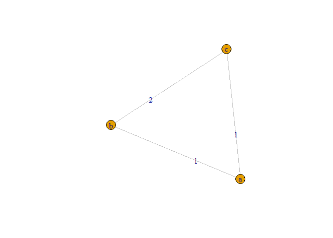
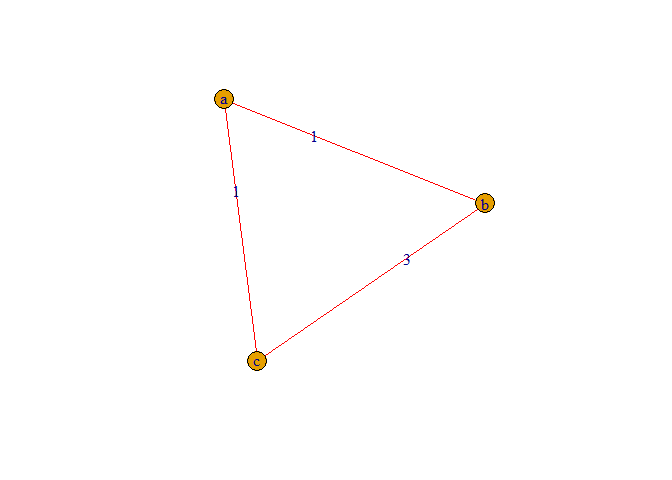
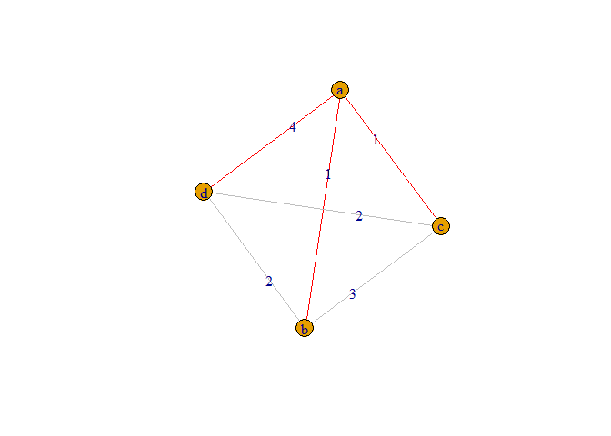
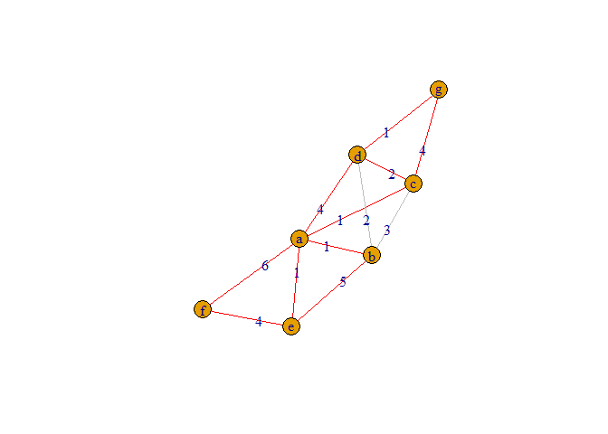
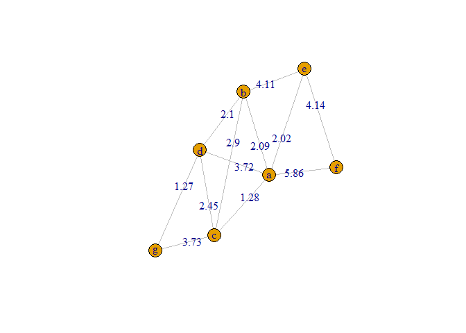

<!-- README.md is generated from README.Rmd. Please edit that file -->

# Triangle Regularization

Given a list of nodes and edge distances, updates edges so that for any
set of three connected nodes, a valid triangle can be formed using the
triangle inequality rule.

<!-- badges: start -->
<!-- badges: end -->

## Installation

You can install the development version of Triangle Regularization from
[GitHub](https://github.com/) with:

``` r
# install.packages("devtools")
devtools::install_github("williamlief/triangleRegularization")
```

## Examples

This is a basic example with a valid triangle, no updates are made. Note
that the edge length labels are NOT proportional to the graphed length -
this is necessary because we will be showing invalid triangles, that is,
cases where you can’t close the shape with the listed edge lengths.

``` r
library(triangleRegularization)

df_edges <-
  tidyr::tribble(
    ~node1, ~node2, ~edge,
    "a", "b", 1,
    "a", "c", 1,
    "b", "c", 2
  )

tris <- get_triangles(df_edges)
triangle_plot(df_edges, tris)
```



``` r
learn_polys(df_edges, tris)
#> # A tibble: 3 × 3
#>   node1 node2  edge
#>   <chr> <chr> <dbl>
#> 1 a     b         1
#> 2 a     c         1
#> 3 b     c         2
```

Now we have an invalid triangle and we update it to be valid. We are
implicitly using equal weights here, so the long side and the short
sides are all adjusted by the same amount.

``` r
df_edges <-
  tidyr::tribble(
    ~node1, ~node2, ~edge,
    "a", "b", 1,
    "a", "c", 1,
    "b", "c", 3
  )

tris <- get_triangles(df_edges)
triangle_plot(df_edges, tris)
```



``` r
update <- learn_polys(df_edges, tris)
triangle_plot(update, tris)
```


Now we have a mix of valid and invalid triangles, with shared edges.

``` r
df_edges <-
  tidyr::tribble(
    ~node1, ~node2, ~edge,
    "a", "b", 1,
    "a", "c", 1,
    "a", "d", 4,
    "b", "c", 3,
    "b", "d", 2,
    "c", "d", 2
  )

tris <- get_triangles(df_edges)
triangle_plot(df_edges, tris)
```



``` r
update <- learn_polys(df_edges, tris)
triangle_plot(update, tris)
```


And finally here is a complex example

``` r

df_edges <-
  tidyr::tribble(
    ~node1, ~node2, ~edge,
    "a", "b", 1,
    "a", "c", 1,
    "a", "d", 4,
    "b", "c", 3,
    "b", "d", 2,
    "c", "d", 2,
    "a", "e", 1,
    "b", "e", 5,
    "a", "f", 6,
    "e", "f", 4,
    "c", "g", 4,
    "d", "g", 1
  )

tris <- get_triangles(df_edges)
triangle_plot(df_edges, tris)
```



``` r
update <- learn_polys(df_edges, tris)
update
#> # A tibble: 12 × 3
#>    node1 node2  edge
#>    <chr> <chr> <dbl>
#>  1 a     b      2.09
#>  2 a     c      1.28
#>  3 a     d      3.72
#>  4 b     c      2.90
#>  5 b     d      2.10
#>  6 c     d      2.45
#>  7 a     e      2.02
#>  8 b     e      4.11
#>  9 a     f      5.86
#> 10 e     f      4.14
#> 11 c     g      3.73
#> 12 d     g      1.27
```

``` r
triangle_plot(update, tris)
```


